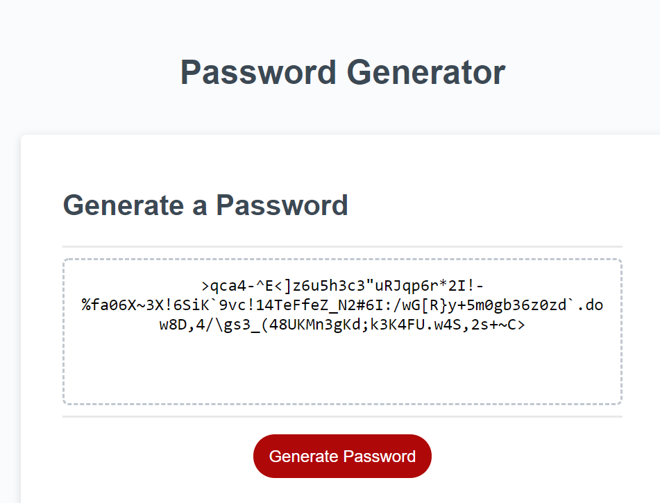

# Password Generator

## Description

The aim of this project was to create a password generator using JavaScript, which would generate a password based on user preferences. Users are able to choose the length of their password (between 8 and 128 characters), as well as what type of characters they would like to include. Core JavaScript skills were used to create this including function expressions, if else statements and for loops.

## Getting Started

```
git clone git@github.com:chelseanicholls95/password_generator.git
cd password_generator
code .
```

## Screenshot



## Link to deployed application

Click [here](https://chelseanicholls95.github.io/password_generator/) to view project.
